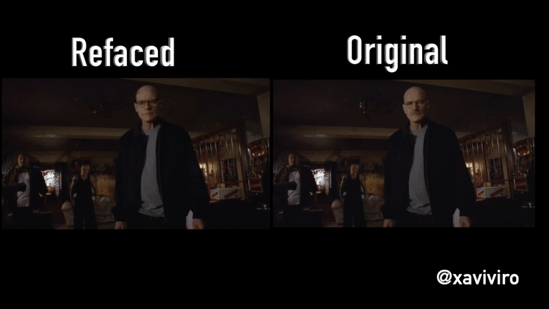

# Refacer: One-Click Deepfake Multi-Face Swap Tool

[](https://colab.research.google.com/github/xaviviro/refacer/blob/master/notebooks/Refacer_colab.ipynb)

👉 [Watch demo on Youtube](https://youtu.be/mXk1Ox7B244)

Refacer, a simple tool that allows you to create deepfakes with multiple faces with just one click! This project was inspired by [Roop](https://github.com/s0md3v/roop) and is powered by the excellent [Insightface](https://github.com/deepinsight/insightface). Refacer requires no training - just one photo and you're ready to go.

:warning: Please, before using the code from this repository, make sure to read the [disclaimer](https://github.com/xaviviro/refacer/tree/main#disclaimer).

## Demonstration



[](https://youtu.be/mXk1Ox7B244)


## System Compatibility

Refacer has been thoroughly tested on the following operating systems:

| Operating System | CPU Support | GPU Support |
| ---------------- | ----------- | ----------- |
| MacOSX           | ✅         | :warning:         |
| Windows          | ✅         | ✅         |
| Linux            | ✅         | ✅         |

The application is compatible with both CPU and GPU (Nvidia CUDA) environments, and MacOSX(CoreML) 

:warning: Please note, we do not recommend using `onnxruntime-silicon` on MacOSX due to an apparent issue with memory management. If you manage to compile `onnxruntime` for Silicon, the program is prepared to use CoreML.

## Prerequisites

Ensure that you have `ffmpeg` installed and correctly configured. There are many guides available on the internet to help with this. Here are a few (note: I did not create these guides):

- [How to Install FFmpeg](https://www.hostinger.com/tutorials/how-to-install-ffmpeg)


## Installation

Refacer has been tested and is known to work with Python 3.10.9, but it is likely to work with other Python versions as well. It is recommended to use a virtual environment for setting up and running the project to avoid potential conflicts with other Python packages you may have installed.

Follow these steps to install Refacer:

1. Clone the repository:
    ```bash
    git clone https://github.com/xaviviro/refacer.git
    cd refacer
    ```

2. Download the Insightface model:
   You can manually download the model created by Insightface from this [link](https://huggingface.co/deepinsight/inswapper/resolve/main/inswapper_128.onnx) and add it to the project folder. Alternatively, if you have `wget` installed, you can use the following command:
    ```bash
    wget --content-disposition https://huggingface.co/deepinsight/inswapper/resolve/main/inswapper_128.onnx
    ```

3. Install dependencies:

    * For CPU (compatible with Windows, MacOSX, and Linux):
    ```bash
    pip install -r requirements.txt
    ```

    * For GPU (compatible with Windows and Linux only, requires a NVIDIA GPU with CUDA and its libraries):
    ```bash
    pip install -r requirements-GPU.txt
    ```

     * For CoreML (compatible with MacOSX, requires Silicon architecture):
    ```bash
    pip install -r requirements-COREML.txt
    ```

    For more information on installing the CUDA necessary to use `onnxruntime-gpu`, please refer directly to the official [ONNX Runtime repository](https://github.com/microsoft/onnxruntime/).

For more details on using the Insightface model, you can refer to their [example](https://github.com/deepinsight/insightface/tree/master/examples/in_swapper).


## Usage

Once you have successfully installed Refacer and its dependencies, you can run the application using the following command:

```bash
python app.py
```

Then, open your web browser and navigate to the following address:

```
http://127.0.0.1:7680
```


## Questions?

If you have any questions or issues, feel free to [open an issue](https://github.com/xaviviro/refacer/issues/new) or submit a pull request.


## Recognition Module

The `recognition` folder in this repository is derived from Insightface's GitHub repository. You can find the original source code here: [Insightface Recognition Source Code](https://github.com/deepinsight/insightface/tree/master/web-demos/src_recognition)

This module is used for recognizing and handling face data within the Refacer application, enabling its powerful deepfake capabilities. We are grateful to Insightface for their work and for making their code available.


## Disclaimer

> :warning: This software is provided "as is", without warranty of any kind, express or implied, including but not limited to the warranties of merchantability, fitness for a particular purpose and noninfringement. In no event shall the authors or copyright holders be liable for any claim, damages or other liability, whether in an action of contract, tort or otherwise, arising from, out of or in connection with the software or the use or other dealings in the software.

> :warning: This software is intended for educational and research purposes only. It is not intended for use in any malicious activities. The author of this software does not condone or support the use of this software for any harmful actions, including but not limited to identity theft, invasion of privacy, or defamation. Any use of this software for such purposes is strictly prohibited.

> :warning: You may only use this software with images for which you have the right to use and the necessary permissions. Any use of images without the proper rights and permissions is strictly prohibited.

> :warning: The author of this software is not responsible for any misuse of the software or for any violation of rights and privacy resulting from such misuse.

> :warning: To prevent misuse, the software contains an integrated protective mechanism that prevents it from working with illegal or similar types of media.

> :warning: By using this software, you agree to abide by all applicable laws, to respect the rights and privacy of others, and to use the software responsibly and ethically.
